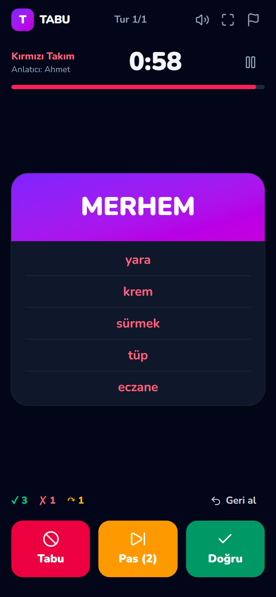
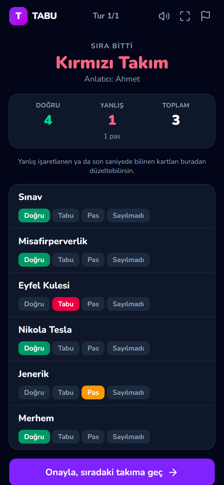
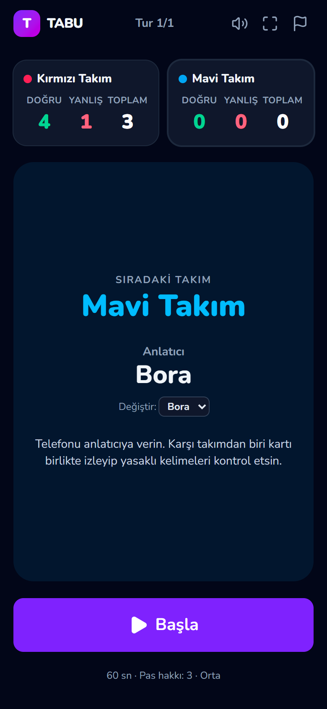
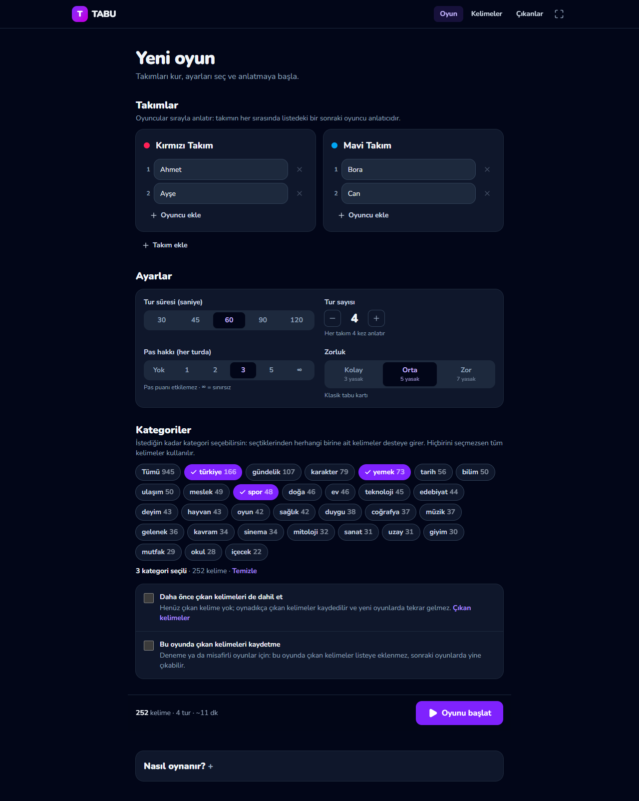
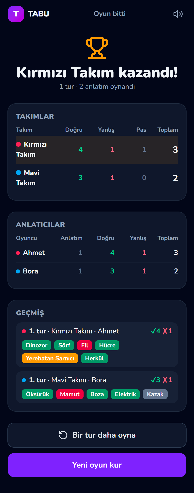
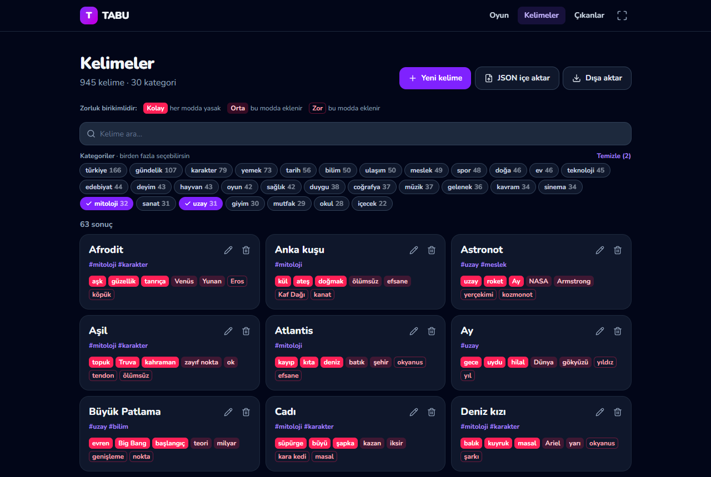
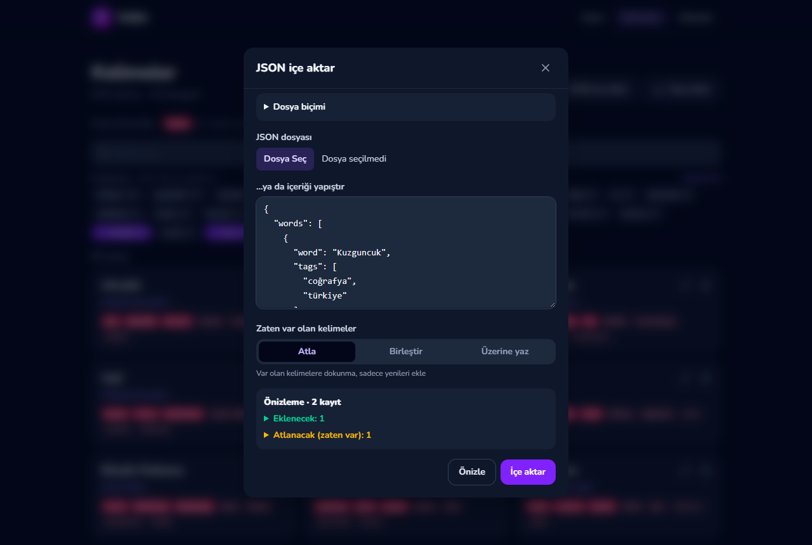

<div align="center">

# Tabu

**Kendi kelimelerinle oynayabileceğin, takım ve skor takipli Tabu oyunu.**

945 hazır kelime · 30 kategori · birikimli 3 zorluk seviyesi · telefonda oynamaya uygun arayüz

&nbsp;
&nbsp;


</div>

## Özellikler

- **Takımlar ve anlatıcı sırası:** 2 takım (4'e kadar), her takımda istediğin kadar oyuncu. Her takımın sırasında
  listedeki bir sonraki oyuncu anlatır; takım büyüklükleri farklı olabilir.
- **Ayrı ayrı skor:** Doğrular ve yanlışlar (tabu) ayrı sayılır, yanlışlar doğrulardan silinmez.
  Toplam skor = doğru − yanlış (5 doğru, 2 yanlış → toplam 3). Pas puanı etkilemez.
- **Birikimli zorluk:** Her kelimenin yasaklıları seviyelere ayrılır. Kolay modda en bariz 3 yasaklı,
  Orta modda 5, Zor modda 7 yasaklı kelime çıkar.
- **Kategoriler:** Bir kelime birden fazla kategoride olabilir; oyun için istediğin kadar kategori seçebilirsin.
- **Oyun akışı:** Süre, tur sayısı ve pas hakkı ayarlanabilir. Geri al, duraklat, sırayı erken bitir var.
  Süre bitince özet ekranında son saniyede bilinen kartı düzeltebilirsin.
- **Kaldığın yerden devam:** Oyun tarayıcıda kayıtlı kalır. Oyun ortasında sayfa kapanır, telefon kilitlenir
  ya da başka uygulamaya geçersen sıra otomatik duraklar; döndüğünde kalan süreyle devam edersin.
- **Kelime yönetimi:** Arayüzden kelime ekle/düzenle/sil, JSON dosyası içe/dışa aktar, komut satırı aracı.
- **Telefona uygun:** Büyük butonlar, ekranın kararmaması (https'te), ses efektleri ve titreşim, klavye kısayolları.

## Ekran görüntüleri

| Oyun kurulumu | Oyun sonu |
| --- | --- |
|  |  |

| Kelimeler | JSON içe aktarma |
| --- | --- |
|  |  |

## Kurulum ve açma

Kısaca (Node.js kuruluysa):

```bash
git clone https://github.com/fignupafya/tabu.git
cd tabu
npm install
npm run build
npm start
```

Sonra tarayıcıda http://localhost:3000 adresini aç. Adım adım anlatım:

### 1. Node.js'i kur (bir kere)

Oyunu çalıştırmak için bilgisayarda [Node.js](https://nodejs.org) 20.9 veya üstü gerekir. Terminale `node -v`
yazıp kontrol et; `v20.9.0` ya da daha yüksek bir sürüm görmelisin. Yoksa nodejs.org'dan **LTS** sürümünü indirip
kur, ardından terminali kapatıp yeniden aç.

> **Terminal nerede?** Windows'ta Başlat menüsünde "Terminal" ya da "PowerShell", macOS'ta "Terminal" uygulaması.

### 2. Projeyi indir (bir kere)

Git ile:

```bash
git clone https://github.com/fignupafya/tabu.git
cd tabu
```

Git yoksa: bu sayfada **Code → Download ZIP** ile indir, ZIP'i bir klasöre çıkar (klasörün adı `tabu-main` olur)
ve terminali o klasörde aç. Windows'ta klasörün içinde boş bir yere sağ tıklayıp **Terminalde aç** diyebilirsin.

### 3. Paketleri kur (bir kere)

```bash
npm install
```

### 4. Oyunu başlat

Oyun gecesi için önerilen yol (hızlı ve hafif):

```bash
npm run build
npm start
```

`npm run build` sadece ilk seferde ve güncellemeden sonra gerekir; sonraki açılışlarda `npm start` yeterli.
Kod üzerinde çalışıyorsan bunların yerine `npm run dev` kullan: değişiklikler anında yansır.

Sunucu açılınca terminal şuna benzer bir çıktı verir:

```
- Local:         http://localhost:3000
- Network:       http://192.168.1.40:3000
```

### 5. Tarayıcıda aç

- **Bilgisayardan:** http://localhost:3000
- **Telefondan:** Telefonu bilgisayarla aynı Wi-Fi'ye bağla ve terminaldeki **Network** adresini
  (ör. `http://192.168.1.40:3000`) telefonun tarayıcısına yaz.
- Windows ilk açılışta güvenlik duvarı izni sorarsa **Özel ağlar** için izin ver; yoksa telefon bağlanamaz.

### 6. Kapatma ve tekrar açma

- Kapatmak için terminalde `Ctrl + C`'ye bas ya da terminal penceresini kapat.
- Tekrar açmak için proje klasöründe `npm start` (ya da `npm run dev`) yeterli; `npm install` bir daha gerekmez.
- Devam eden oyun telefonun tarayıcısında kayıtlıdır: sunucu kapanıp açılsa da ana sayfadaki **Devam et** ile
  kaldığın yerden sürer.
- Oyun sırasında bilgisayar uyku moduna geçmesin; uykudayken telefonlar bağlanamaz.

### 7. Güncelleme

```bash
git pull
npm install
npm run build
```

Kendi eklediğin kelimeler `data/words.json` dosyasında durur ve `git pull` bu dosyada çakışma verebilir.
Güncellemeden önce *Kelimeler → Dışa aktar* ile yedek almak en güvenlisi.

### Sorun giderme

| Sorun | Çözüm |
| --- | --- |
| `node` ya da `npm` bulunamadı | Node.js'i kur, terminali kapatıp yeniden aç. |
| `EADDRINUSE: address already in use :::3000` | 3000 portunu başka bir program kullanıyor. Onu kapat ya da başka port seç: `npm start -- -p 3001`. (`npm run dev` boş porta kendisi geçer; terminaldeki adresi kullan.) |
| `Another next dev server is already running` | Bu proje için açık bir `npm run dev` zaten var; o pencereyi kullan ya da kapatıp yeniden başlat. |
| Telefon siteyi açamıyor | Aynı Wi-Fi'de olduğunu, güvenlik duvarında Node.js'e özel ağ izni verildiğini ve adresin `http://` ile başladığını kontrol et. Misafir Wi-Fi ağları cihazların birbirini görmesini engelleyebilir. |
| "Kelime dosyası okunamadı" hatası | `data/words.json` elle düzenlenirken bozulmuş olabilir; `npm run words -- check` hatalı satırları gösterir. |

## Nasıl oynanır?

1. Takımları ve oyuncuları gir, süreyi, tur sayısını, pas hakkını, zorluğu ve kategorileri seç.
2. Takımlar sırayla oynar. Anlatıcı kartın üstündeki kelimeyi yasaklı kelimeleri kullanmadan anlatır;
   kelimenin kendisi ve yasaklıların türevleri de yasaktır. El kol hareketi, ses taklidi ve "… ile başlar"
   gibi ipuçları yok.
3. Karşı takımdan biri kartı anlatıcıyla birlikte izler ve yasaklı kelime söylenirse "Tabu!" der.
4. **Doğru** → +1 doğru, **Tabu** → +1 yanlış, **Pas** → puan değişmez (hak sınırlıysa azalır).
5. Süre bitince özet ekranı açılır; gerekiyorsa düzelt, onayla, telefon sıradaki anlatıcıya geçsin.
6. Bütün takımlar birer kez oynayınca bir tur biter. Turlar bitince toplam skoru en yüksek takım kazanır.

## Kelimeler

Kelimeler [`data/words.json`](data/words.json) dosyasında durur:

```json
{
  "words": [
    {
      "word": "Çay",
      "tags": ["içecek", "türkiye"],
      "taboo": {
        "easy": ["demlik", "bardak", "sıcak"],
        "medium": ["Rize", "şeker"],
        "hard": ["kahve", "içmek"]
      }
    }
  ]
}
```

- **Zorluk birikimlidir:** Kolay modda sadece `easy`, Orta modda `easy + medium`, Zor modda hepsi yasaktır.
  Bu yüzden `easy`'ye en bariz çağrışımlar yazılır.
- Bir kelime birden fazla kategoride (`tags`) olabilir. Zorunlu olanlar sadece `word` ve `taboo.easy`.
- `taboo` düz bir liste de olabilir (`"taboo": ["a", "b"]`); o zaman hepsi `easy` sayılır.
- Aynı kelime büyük/küçük harf farkıyla tekrar sayılır (`ÇAY` = `Çay`), ama Türkçe harfler ayrı tutulur
  (`Kır` ≠ `Kir`).
- VS Code, dosyadaki `$schema` sayesinde alanları otomatik tamamlar ve hataları gösterir.

### Kelime eklemenin üç yolu

1. **Arayüz:** *Kelimeler* sayfasında "Yeni kelime" formu ya da "JSON içe aktar". İçe aktarmadan önce
   önizleme gösterir; var olan kelimeler için **Atla**, **Birleştir** (yeni etiket ve yasaklıları ekle) ya da
   **Üzerine yaz** seçilir.
2. **Komut satırı:** `npm run words -- add yeni-kelimeler.json --dry-run`, sonra `--dry-run` olmadan.
3. **Claude Code ile:** "Spor kategorisine 30 kelime ekle" demen yeterli. [`CLAUDE.md`](CLAUDE.md)'deki
   talimatla önce var olan kelimeleri komut satırı aracıyla listeler (dosyanın tamamını okumadan),
   tekrar etmeyen kelimeleri hazırlar, doğrular ve ekler.

### Komut satırı aracı

| Komut | Ne yapar |
| --- | --- |
| `npm run -s words -- list` | Kelimeleri listeler (`--inline`, `--with-tags`, `--tag yemek,spor`, `--search çay`) |
| `npm run -s words -- tags` | Kategoriler ve kelime sayıları |
| `npm run -s words -- stats` | Özet istatistikler |
| `npm run -s words -- show Çay "Kara delik"` | Seçilen kelimelerin tam kaydı |
| `npm run -s words -- check` | Dosyayı doğrular: hatalar, tekrarlar, kalite uyarıları |
| `npm run -s words -- add dosya.json` | Ekler (`--strategy skip\|merge\|replace`, `--dry-run`) |
| `npm run -s words -- remove Kelime` | Siler |
| `npm run -s words -- schema` | Editör desteği için `data/words.schema.json` üretir |

## Mimari

Next.js 16 (App Router), React 19, Tailwind CSS 4 ve TypeScript. Ön yüz ve arka uç aynı uygulamada;
yapı **ports & adapters** (adaptör) tasarımında: oyun kuralları ve kelime işlemleri framework'ten bağımsız
`src/core` içinde, depolama gibi dış dünyaya dokunan her şey bir arayüzün arkasında ve değiştirilebilir.

```
src/core/words      kelime modeli, zorluk seviyeleri, doğrulama, WordService, WordRepository (port)
src/core/game       saf oyun motoru (gameReducer), puanlama, kurulum, GameStorage (port)
src/adapters        JsonFileWordRepository, InMemoryWordRepository, LocalStorageGameStorage
src/server          sunucu tarafı kompozisyon noktası: hangi adaptörün kullanılacağı
src/app/api         REST uç noktaları
src/app, components arayüz: kurulum, oyun, kelimeler
scripts/            kelime aracı (words.ts), README ekran görüntüleri (screenshots.ts)
```

- Oyun motoru saf bir reducer'dır: zaman ve rastgelelik dışarıdan gelir. Bu yüzden kolay test edilir ve
  ileride çok cihazlı oyun için aynen sunucuda çalışabilir.
- **Veritabanına geçmek** için `WordRepository` arayüzünü uygulayan bir adaptör yazıp
  `src/adapters/words/create-word-repository.ts` içine eklemek yeterli; `WORD_STORE` ortam değişkeniyle seçilir.
- **Yeni zorluk seviyesi** eklemek için `src/core/words/difficulty.ts` içindeki listeye eklemek yeterli.

**API:** `GET /api/words?search=&tags=` · `POST /api/words` · `GET|PUT|DELETE /api/words/:kelime` ·
`POST /api/words/import` (`{ data, strategy, dryRun }`) · `GET /api/words/export` · `GET /api/tags` ·
`GET /api/deck?difficulty=medium&tags=yemek,spor`

## Geliştirme

```bash
npm test               # birim testleri (oyun motoru, kelime servisi, doğrulama)
npm run typecheck
npm run lint
npm run build
npm run screenshots    # README görsellerini yeniden üretir (sunucu açıkken, yüklü Chrome/Edge ile)
```

## Bilinmesi gerekenler

- JSON dosya deposu yazılabilir disk ister. Kendi bilgisayarında ya da bir sunucuda sorunsuz çalışır;
  Vercel gibi sunucusuz ortamlarda eklenen kelimeler kalıcı olmaz, orada bir veritabanı adaptörü gerekir.
- Ekranın kararmasını engelleme özelliği tarayıcılarda sadece güvenli bağlantıda (https ya da localhost) çalışır.
- Tailwind CSS 4 kullanıldığı için modern tarayıcı gerekir (iOS 16.4+, Chrome 111+).
